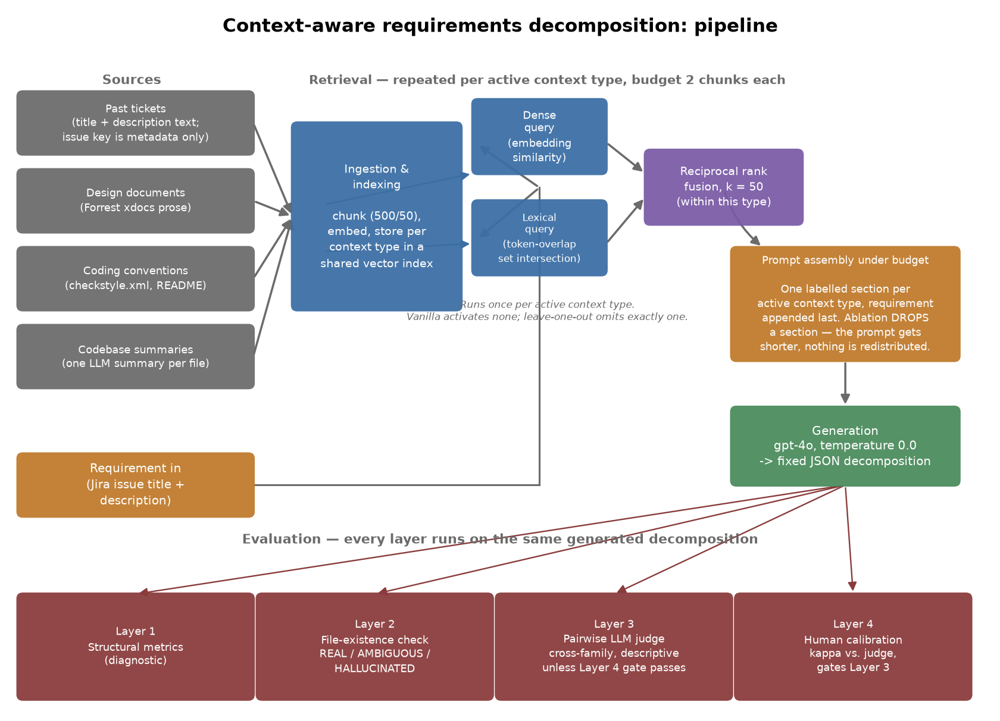

# Context-Aware Requirements Decomposition with Retrieval-Augmented LLMs

Codebase for my MSc thesis of the same name (Liverpool John Moores University). I built a RAG
pipeline that turns Apache Pig (SEOSS 33) business requirements into developer-ready user stories,
and a four-layer framework that evaluates what it produces.

**Status: the experiment is complete.** All six conditions ran across the twenty frozen
requirements on run `20260814T033139Z`, giving 120 decompositions and 140 reconciled pairwise
comparisons. `RESULTS.md` and `results/README.md` hold the full numbers; this file is the fast
path into them.

## 1. What it does

A Jira-style requirement (title and description) goes in. A structured decomposition into
developer-ready user stories, each with acceptance criteria and candidate source files, comes out.
Retrieval grounds that decomposition in four kinds of project context: past tickets, design
documents, coding conventions, and codebase summaries, each retrieved independently under its own
budget.

## 2. Why it's interesting

- **Hybrid retrieval with reciprocal rank fusion.** Each context type is retrieved by a dense
  (embedding) channel and a lexical (token-overlap) channel, then fused with Reciprocal Rank Fusion
  (Cormack et al., 2009), constant k = 50, rather than blended by raw score.
- **A four-layer evaluation framework**, not a single metric: structural shape, programmatic file-
  existence grounding, a pairwise LLM judge, and a researcher-run calibration check that gates
  whether the judge can be trusted.
- **An LLM judge with human calibration**, cross-family from the generator and blind to condition,
  checked against a blinded human rating pass with Cohen's kappa before its verdicts are allowed to
  count as a primary result.

## 3. Architecture



(Source: [`docs/architecture_diagram.py`](docs/architecture_diagram.py), a matplotlib script;
regenerate with `.venv/bin/python docs/architecture_diagram.py`.)

The four context types are ingested and chunked (500 characters, 50 overlap) once and embedded into
a shared vector index. For each incoming requirement, every *active* context type (which types are
active is what defines the condition, see below) is retrieved on its own: a dense query and a
lexical query each produce a ranked list, and Reciprocal Rank Fusion combines them within that type,
at a budget of two chunks per type. Prompt assembly then builds one labelled section per active
type and appends the requirement last; an ablation condition doesn't redistribute the freed budget
to the remaining types, it just drops that section, so the prompt gets shorter. The generator
(GPT-4o, temperature 0.0) turns the assembled prompt into a fixed-schema JSON decomposition. Every
decomposition then passes through all four evaluation layers: Layer 1 structural metrics, Layer 2
file-existence grounding, Layer 3 the pairwise judge, and Layer 4 the human calibration check that
decides whether Layer 3 counts as a primary result for this run.

## 4. Worked example: PIG-692

One requirement, carried through the pipeline, comparing the vanilla and full-RAG conditions. Pulled
from the committed run artefacts for `20260814T033139Z`, not regenerated.

**Requirement (PIG-692).** Title: *"when running script file, automatically set up job name based
on the file name."* Description: *"When running pig script from command like like this: pig
scriptfile — right now default job name is used. it is convenient to have it automatically set up
based on the script name."*

**What full-RAG retrieval pulled** (two chunks per type, from
[`PIG-692__full_rag.prompt.txt`](data/runs/20260814T033139Z/PIG-692__full_rag.prompt.txt)):
past tickets about a `-q` queue-name flag and a per-script job id; design-document passages on the
`-F`/`-stop_on_failure` flag and the `exec` command; two coding-convention chunks from the project
README; and two codebase summaries, of `ScriptState` and `PigServer`, the two classes that turn out
to matter here.

**Vanilla output** (no retrieval): two user stories, source files
`src/org/apache/pig/Main.java` and `src/org/apache/pig/tools/pigscript/PigScriptRunner.java`.
Layer 2 verdict: 2 of 3 file references HALLUCINATED (66.7%).

**Full-RAG output**: three user stories (the extra one is a unit-test story), source files
`src/org/apache/pig/tools/pigscript/PigServer.java`, `src/org/apache/pig/impl/util/ScriptState.java`,
and `test/org/apache/pig/test/TestPigServer.java`. Layer 2 verdict: 1 of 4 file references
HALLUCINATED (25%); the rest moved to AMBIGUOUS, not to REAL.

**The judge's read** (Layer 3, both presentation orders, from
[`results/judgments.jsonl`](results/judgments.jsonl) and
[`results/judgments_raw.jsonl`](results/judgments_raw.jsonl)): full-RAG won on all five criteria in
both orders, no positional inconsistency. Reasoning quote: *"references more plausible existing
files (PigServer.java, ScriptState.java) grounded in the actual Apache Pig codebase, includes
testing stories, and has clearer acceptance criteria."*

This one cell shows the pipeline working the way the design intends: real codebase context steered
the model away from an invented file name and toward the classes that actually own this behaviour.
It is not representative of the aggregate, though. Across all 20 requirements, the same SQ2 judge
comparison came out 7 wins for full-RAG against 9 for vanilla, a null result (see Results below).

## 5. Results

The straight numbers, pulled from [`RESULTS.md`](RESULTS.md) and
[`results/aggregates.json`](results/aggregates.json). Generator: GPT-4o, temperature 0.0, fixed
across all six conditions. Judge: a different model family, enforced in code.

**The one validated positive result.** Retrieval reduced file-reference hallucination from a mean
of 70.3% (vanilla) to 49.6% (full-RAG condition). Wilcoxon signed-rank test, p = 0.039,
rank-biserial effect size 0.57, n = 17 decided pairs. That reduction was a shift from HALLUCINATED
to AMBIGUOUS rather than to REAL: the confirmed-real rate barely moved (6.7% to 5.8%), while
AMBIGUOUS rose from 23.0% to 44.6%. Context stopped the model inventing file names; it did not
reliably make it name the right ones.

**SQ1 (which context type carries the effect) is a null result, not a negative one.** Dropping any
single context type from full-RAG (past tickets, design documents, coding conventions, codebase
summaries) produced no significant change in hallucination rate after Holm-Bonferroni correction;
the smallest adjusted p-value was 0.75. I found no evidence that any one context type drives the
grounding effect on its own. Two things limit how much this null result can support: each type is
retrieved at a budget of two chunks, so its marginal contribution is small by construction, and the
decided-pair counts feeding each test are modest (n = 9 to 14 out of 20), since sign tests only use
pairs with a clear winner. A pre-specified null across four tests with n = 20 is still a result
worth reporting, not a study that failed to find something that was there.

**Well-formedness came out lower under full-RAG than vanilla:** 77.9% vanilla versus 63.3% full-RAG
(Layer 1, structural metrics). More context did not produce more schema-conformant output in this
run. This is reported as found, not smoothed over.

**Layer 3 (the pairwise judge) is reported descriptively, not as a primary quality signal.** The
full-RAG-versus-vanilla quality comparison split 7 wins to 9 (vanilla ahead), sign-test p = 0.80: I
found no evidence that retrieval improved judged quality. The reason it stays descriptive rather
than primary is the calibration result below.

**Layer 4 calibration fell short of its pre-specified gate.** Researcher-versus-judge agreement on
a blinded 20-pair sample: Cohen's kappa = 0.56 (n = 19, raw agreement 84%), against a threshold of
0.60 fixed before the run. Because the gate was not met, Layer 3 is reported descriptively only,
and Layers 1 and 2 carry the primary conclusions, exactly as the pre-specified contingency called
for. Full reasoning and the discarded-alternative note are in
[`docs/DECISION_LAYER4_calibration.md`](docs/DECISION_LAYER4_calibration.md), linked rather than
re-summarised here.

Also recorded: 15.0% of the 140 pairwise comparisons (21 of 140) changed winner when presentation
order was swapped.

These are case-study findings on one project (Apache Pig), twenty requirements, one generator
model. They describe this setting; they are not a claim about RAG in general.

## 6. Run it

```bash
python -m venv .venv && source .venv/bin/activate
pip install -r requirements.txt
cp .env.example .env    # fill in OPENAI_API_KEY / ANTHROPIC_API_KEY / WANDB_API_KEY
pytest
```

`pytest` (159 tests) and the command below were both run against this checkout while writing this
README and passed.

Reproducing the full run additionally needs the SEOSS 33 Apache Pig SQLite dump and a local clone of
`apache/pig`, neither of which is committed (see [`DATA_PROVENANCE.md`](DATA_PROVENANCE.md) for
where they come from and how the clone is verified). But regenerating every number in this README
and in `RESULTS.md` needs neither of those and needs no API key, because it reads only the committed
`results/` artefacts:

```bash
python scripts/aggregate_results.py --run-id 20260814T033139Z
```

That one command reproduces Tables 4.1 to 4.5 and the positional-inconsistency figure, writing
`results/aggregates.json`. It calls no external API and needs neither the SEOSS dump nor the Pig
clone, since it reads only the committed `results/` directory.

The full generation-to-judgment sequence that these aggregates ultimately rest on — freeze the
sample, build the four indexes, generate, judge, then calibrate — is one script per step under
`scripts/` (`freeze_requirements.py`, `build_index.py`, `run_experiment.py`, `run_judge.py`,
`build_calibration_set.py`, `score_calibration.py`). It calls paid model APIs and is not
deterministic across providers or model versions, so it is not the one command reproduced here;
`CLAUDE.md`'s build order records the sequence it was run in.

## 7. Repo map

- `src/schema.py` — the fixed decomposition JSON contract
- `src/conditions.py` — six ablation conditions, four context types
- `src/data/` — SEOSS loader, requirement sampling, SEOSS-to-clone commit resolver
- `src/retrieval/` — chunking, RRF fusion, ChromaDB index, hybrid and per-type retrieval
- `src/pipeline/` — prompt assembly and per-condition generation
- `src/eval/` — Layer 1 structural, Layer 2 file verifier, Layer 3 judge and comparisons, Layer 4 calibration
- `src/analysis/` — Wilcoxon, rank-biserial, Holm-Bonferroni, Cohen's kappa
- `src/paths.py` / `src/utils/` — default input/output locations and small shared helpers
- `scripts/` — experiment runner, judge runner, calibration build and scoring, aggregation, SEOSS profiler
- `prompts/` — decomposition and pairwise-judge templates
- `config/config.yaml` — models, temperature, commit window, judge criteria; secrets in `.env`
- `data/frozen/` — the frozen twenty-requirement sample and other committed inputs
- `results/` — final run artefacts substantiating every thesis table (see `results/README.md`)
- `docs/` — signed decision records for design choices taken during the study, plus the
  architecture diagram and its source
- `tests/` — the test suite covering everything above
- `curated/`, `derived/`, `notebooks/` — currently empty; reserved for hand-curated inputs,
  derived artefacts, and exploratory notebooks respectively

## Licence and citation

Academic work submitted for the MSc programme at Liverpool John Moores University. Apache Pig data
originates from the SEOSS 33 dataset (Rath and Mader, 2019), which carries its own licence terms.
